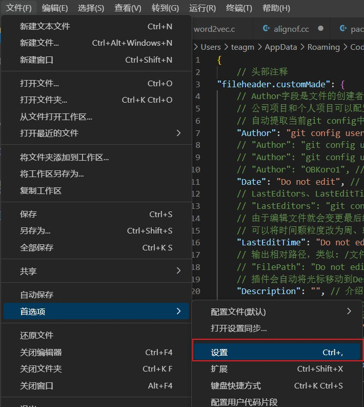

# 插件使用说明文档的地址

https://github.com/OBKoro1/koro1FileHeader/



## 在设置栏中找到fileheader拓展


## 将以下文件头模版拷贝到上述settings.json文件中

```json
{
    // 头部注释
"fileheader.customMade": {
    // Author字段是文件的创建者 可以在specialOptions中更改特殊属性
    // 公司项目和个人项目可以配置不同的用户名与邮箱 搜索: gitconfig includeIf  比如: https://ayase.moe/2021/03/09/customized-git-config/
    // 自动提取当前git config中的: 用户名、邮箱
    "Author": "git config user.name && git config user.email", // 同时获取用户名与邮箱
    // "Author": "git config user.name", // 仅获取用户名
    // "Author": "git config user.email", // 仅获取邮箱
    // "Author": "OBKoro1", // 写死的固定值 不从git config中获取
    "Date": "Do not edit", // 文件创建时间(不变)
    // LastEditors、LastEditTime、FilePath将会自动更新 如果觉得时间更新的太频繁可以使用throttleTime(默认为1分钟)配置更改更新时间。
    // "LastEditors": "git config user.name && git config user.email", // 文件最后编辑者 与Author字段一致
    // 由于编辑文件就会变更最后编辑时间，多人协作中合并的时候会导致merge
    // 可以将时间颗粒度改为周、或者月，这样冲突就减少很多。搜索变更时间格式: dateFormat
    "LastEditTime": "Do not edit", // 文件最后编辑时间
    // 输出相对路径，类似: /文件夹名称/src/index.js
    // "FilePath": "Do not edit", // 文件在项目中的相对路径 自动更新
    // 插件会自动将光标移动到Description选项中 方便输入 Description字段可以在specialOptions更改
    "Description": "", // 介绍文件的作用、文件的入参、出参。
    // custom_string_obkoro1~custom_string_obkoro100都可以输出自定义信息
    // 可以设置多条自定义信息 设置个性签名、留下QQ、微信联系方式、输入空行等
    "custom_string_obkoro1": "",
    // 版权声明 保留文件所有权利 自动替换年份 获取git配置的用户名和邮箱
    // 版权声明获取git配置, 与Author字段一致: ${git_name} ${git_email} ${git_name_email}
    "custom_string_obkoro1_copyright": "Copyright (c) ${now_year} by company-A, All Rights Reserved."
    // "custom_string_obkoro1_copyright": "Copyright (c) ${now_year} by 写死的公司名/用户名, All Rights Reserved. "
},
// 函数注释
"fileheader.cursorMode": {
    "description": "", // 函数注释生成之后，光标移动到这里
    "param": "", // param 开启函数参数自动提取 需要将光标放在函数行或者函数上方的空白行
    "return": "",
}
}
```

# 产生文件注释快捷键

windows:   ctrl+win+i

创建一个文件，输入ctrl+win+i 快捷键即可生成文件注释

# 函数注释快捷键

`window`：`ctrl+win+t`

```json
"fileheader.configObj": {
    "functionParamsShape": ["{", "}"]    //参数类型如{int}、{char}
    // "functionParamsShape": "no type" // 不需要参数类型
}
```


**单行函数声明参数提取**

将鼠标光标放置于函数声明那一行，然后按函数注释快捷键生成函数注释

**多行函数声明参数提取**

鼠标左键选择多行函数声明区域，函数声明区域尽量精准，按快捷键生成，