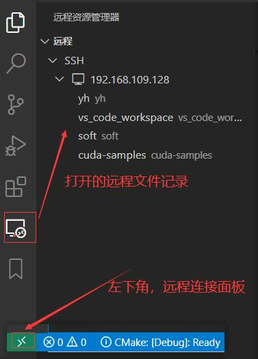

<!--
 * @Author: teaCupa yehu2315272482@Foxmail.com
 * @Date: 2023-04-01 11:38:14
 * @LastEditTime: 2023-04-01 12:13:52
 * @Description:
 *
 * Copyright (c) 2023 by company-A, All Rights Reserved.
-->
# 参考 https://zhuanlan.zhihu.com/p/614866603
## Bookmarks
书签可以在多个函数间快速定位和跳转，开启书签和关闭书签都很方便

## compareit
- 文件内容比较器，具体使用如下：

- 对比结果如下：

## Markdown All in One
在vscode中集成markdown,方便查看markdown效果

## Remote - SSH
方便连接远程机器，在终端中使用远程机器软件
